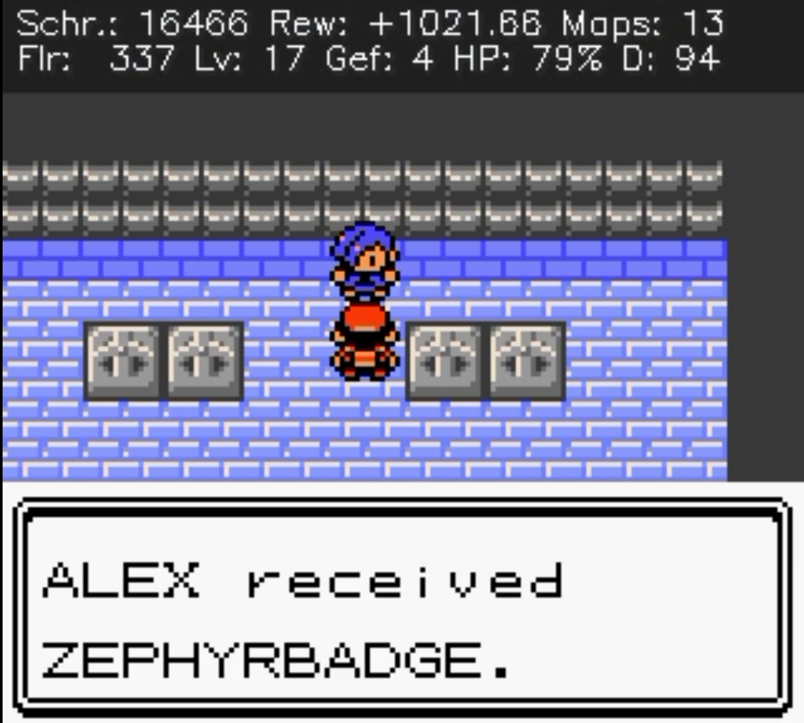
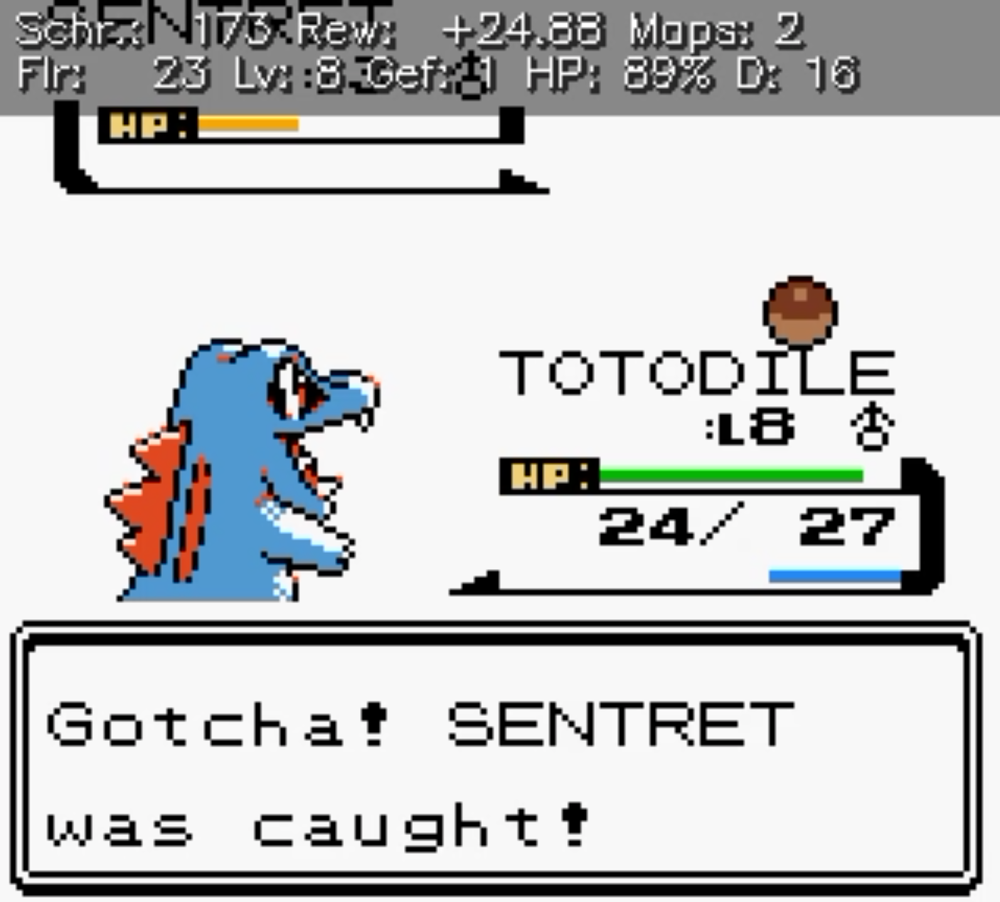
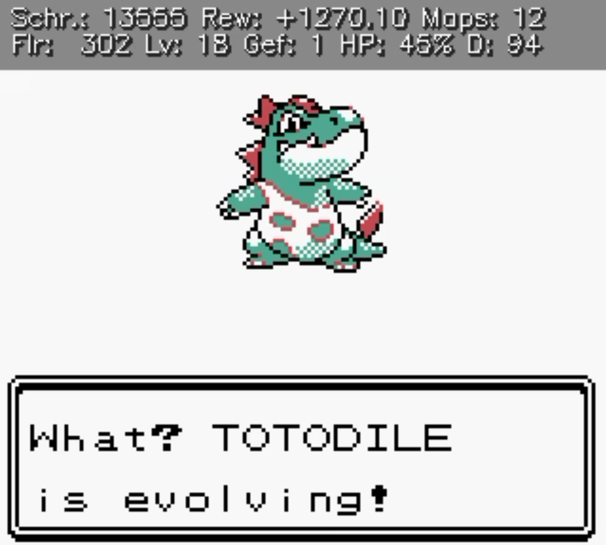

# 🎮 Reinforcement Learning – Pokémon Gold

Ein **PPO-Agent**, der lernt, **Pokémon Gold** selbstständig zu spielen — nur aus dem Spielbild und den RAM-Werten, bis zum ersten Orden und darüber hinaus. Trainiert mit [stable-baselines3](https://github.com/DLR-RM/stable-baselines3) über den GameBoy-Emulator [PyBoy](https://github.com/Baekalfen/PyBoy), auf **20 parallelen Emulatoren** gleichzeitig.

> **Zielroute:** New Bark Town → Route 29 → Cherrygrove → Route 30/31 → Violet City → **Falkner besiegen (1. Orden)** → Route 32 → Union Cave → Azalea …

<p align="center">
  
  <br>
  <em>🏅 Ziel erreicht: Der Agent erspielt den 1. Orden. Oben das Live-Trainings-Overlay (Schritt, Reward, Maps, Level, HP …).</em>
</p>

---

## 🎓 Für Einsteiger: Was ist Reinforcement Learning? Was macht PPO?

**Reinforcement Learning (RL)** ist Lernen durch Versuch und Irrtum. Anders als beim klassischen maschinellen Lernen gibt es **keine Beispiel-Lösungen** — niemand zeigt der KI, welche Taste richtig ist. Stattdessen probiert der **Agent** (die KI) Aktionen aus, und die **Umgebung** (das Spiel) antwortet mit einer neuen Situation und einer Zahl: dem **Reward**.

```
  Beobachtung (Bild + Spielzustand)
         │
         ▼
  Agent wählt eine Taste ──► Spiel reagiert ──► Reward (+/−)
         ▲                                        │
         └────────── Policy anpassen ◄────────────┘
```

Am Anfang drückt der Agent zufällig herum. Aktionen, die — auch erst viel später — zu Belohnung führen, werden wahrscheinlicher: So entsteht Schritt für Schritt eine **Policy** (Strategie). Maximiert wird dabei nicht der nächste Reward, sondern die **Summe über die Zukunft**, leicht abgezinst mit dem Discount-Faktor γ („Reward heute zählt mehr als Reward in 1000 Schritten").

Zwei Konsequenzen daraus prägen dieses Projekt:

- **Das Reward-Design ist die eigentliche Arbeit.** Die KI lernt exakt das, was belohnt wird — inklusive aller Schlupflöcher. Viele der Mechanismen unten sind Antworten auf tatsächlich gefundene Exploits (*Reward-Hacking*: Tür-rein-raus-Farming, Ei-Doppelbelohnung, …).
- **Das Signal muss dicht genug sein.** „+400 für den Orden" allein reicht nicht — die Chance, per Zufall vom Start bis zur Arena zu stolpern, ist praktisch null. Deshalb bekommt der Agent ein dichtes Vorwärtssignal entlang der Route (Gain-Reward).

**PPO (Proximal Policy Optimization)** ist der Algorithmus, der die Policy anpasst — der heutige De-facto-Standard. Er arbeitet in einer Schleife:

1. **Sammeln:** Die aktuelle Policy spielt — hier auf 20 Emulatoren parallel, ~82.000 Spielschritte pro Runde.
2. **Bewerten:** Für jede Aktion wird der **Advantage** berechnet: *War das Ergebnis besser oder schlechter als erwartet?* Die Erwartung liefert ein zweiter Kopf desselben Netzes (der **Critic**), der jeden Zustand bewertet — die Actor-Critic-Architektur.
3. **Anpassen:** Überdurchschnittlich gute Aktionen werden wahrscheinlicher, schlechte unwahrscheinlicher.

Das **„Proximal"** ist der Clou: PPO **begrenzt (clippt)** jede Änderung, sodass die neue Policy nie weit von der alten abweicht. Ein einzelner verrauschter Datenblock kann so nicht die ganze gelernte Strategie zerstören — das macht PPO stabil und vergleichsweise gutmütig im Tuning. Ein kleiner **Entropie-Bonus** (`ENT_COEF`) belohnt zusätzlich Unentschlossenheit, damit der Agent neugierig bleibt und nicht zu früh in einer Routine erstarrt.

---

## 🧠 Wie es funktioniert

Der Agent sieht in jedem Schritt:

- **Bild:** das GameBoy-Bild als 84×84-Graustufen (verarbeitet von einem **CNN**)
- **Zustand:** 17 kompakte **RAM-/Navigations-Features** (verarbeitet von einem **MLP**) — lokale Position, globale Weltkoordinaten, HP, Team-Level, PP, „Ei im Team", Kampfstatus, geglättete Bewegungsrichtung u. a.

…und wählt eine von **6 Aktionen** (hoch / runter / links / rechts / A / B). Gelernt wird per **PPO** mit `MultiInputPolicy` (CNN + MLP) über 20 parallele Umgebungen (`SubprocVecEnv`).

---

## ✨ Die interessanten Mechanismen

Der Kern des Projekts steckt im **Reward-Design** — hier die Highlights:

- **Gain-Reward (Pfad-Fortschritt):** Statt radialer Distanz zum Start misst der Agent den Fortschritt *entlang der intendierten Route* und wird nur für die **Zunahme** belohnt → ein dichtes, richtungs-korrektes Vorwärtssignal, das ihn gezielt zum Ziel zieht statt in Sackgassen. Tod-/Teleport-robust und gegen „Tür-rein-raus-Farming" abgesichert.
- **Weltkoordinaten (Seam-Stitching):** Die pro Karte nur lokalen RAM-Koordinaten werden zu einer durchgehenden Weltebene zusammengeklebt → der Agent entwickelt ein Gefühl für „Richtung" und „Nähe".
- **Phasen-Navigation (Ei-Quest):** Die Reward-Struktur schaltet mit dem Spielfortschritt um: Nach dem 1. Orden wird die Arena zur Trap-Map, ein eigener Gain zieht zum Pokécenter (dort wartet das Togepi-Ei — ohne das Route 32 gesperrt ist), und mit dem Ei übernimmt wieder der normale Routen-Gain. Da Orden und Ei nie „zurückgehen", ist die Umschaltung unausnutzbar — und der Agent *sieht* beide Zustands-Bits, kann die Phasen also unterscheiden.
- **Curriculum Learning:** Ein Pool von Savestates (Gruppen *start / middle / end*) lässt den Agenten alle Gebiete **gleichzeitig** üben und frühere nicht vergessen.
- **Navigations-Gedächtnis:** explizite Features (Bewegungsrichtung, Kartenwechsel, „Schritte seit Kartenwechsel") gegen Pendeln an mehrdeutigen Stellen — billiger und kontrollierbarer als ein LSTM.
- **Grind-Sättigung:** XP-/Schadens-Reward flacht pro Karte hyperbolisch ab → Anti-Camping, ohne Kämpfe hart zu verbieten.
- **Trap-Maps:** nutzlose Innenräume geben beim Betreten eine kleine Strafe → der Agent bleibt auf der produktiven Route.
- **Zustands-skalierter Boss-Meilenstein:** Der Arena-Bonus skaliert mit HP & PP beim Betreten — frisch geheilt zahlt er das Vierfache des angeschlagenen Werts. So lernt der Agent die Sequenz „erst ins Pokécenter, dann zum Boss" (und ein geheilter Anlauf senkt nebenbei die Kosten einer Niederlage: Respawn im nahen PC statt am Spielstart).
- **Flucht-Logik:** Strafe fürs Weglaufen aus *gewinnbaren* Kämpfen, Bonus fürs Verlassen *aussichtsloser* (z. B. leere Angriffs-PP).
- **Robustheit:** Ein Absturz eines Worker-Emulators reißt nicht das ganze Training mit — das Modell wird bei einem Crash gerettet.

> 📖 Ausführliche Herleitung, Diagnosen und (auch die verworfenen) Ansätze stehen im **[Projekt-Protokoll](Projekt-Protokoll.md)**.

---

## 🏅 Meilensteine

Neben dem Orden (oben) hat der Agent unterwegs weitere Etappen selbst gemeistert:

<table align="center">
  <tr>
    <td align="center" valign="top">
      
      <br><em>Erster Fang – ein Sentret</em>
    </td>
    <td align="center" valign="top">
      
      <br><em>Erste Entwicklung – Totodile → Croconaw</em>
    </td>
  </tr>
</table>

---

## 📁 Projektstruktur

| Datei | Zweck |
|---|---|
| `train.py` | Trainings-Einstieg: PPO, parallele Envs, Logging, Crash-Sicherung |
| `pokemon_env.py` | Gymnasium-Umgebung: Reward-Logik, Beobachtungen, PyBoy-Steuerung |
| `ram_reader.py` | liest den Spielzustand aus dem RAM (Position, HP, Level, Orden, Ei …) |
| `global_coords.py` | Seam-Stitching → globale Weltkoordinaten |
| `config.py` | **alle Hyperparameter & das Savestate-Curriculum** |
| `debug_ram.py` | Live-RAM-Tracker (RAM-Adressen verifizieren, Reward-Nähte prüfen) |
| `record.py` | Agenten-Läufe aufzeichnen / abspielen |
| `Savestates/` | Start-Savestates (Curriculum) + `create_savestate.py` |
| `Projekt-Protokoll.md` | ausführliches Entwicklungs-Log |

---

## 🚀 Setup

### Voraussetzungen
- **Python 3.13**
- Eine **eigene Pokémon-Gold-ROM.** Aus rechtlichen Gründen ist **keine ROM im Repo enthalten** — lege deine legal beschaffte ROM als `PGV.gbc` ins Projekt-Wurzelverzeichnis (Pfad steht in `config.py → ROM_PATH`).

### Installation
```bash
pip install pyboy stable-baselines3 gymnasium numpy opencv-python torch tensorboard
```
*(TensorFlow wird nur für die TensorBoard-Ansicht mitgezogen; fürs Training selbst genügt PyTorch.)*

---

## ▶️ Nutzung

**Training starten** (20 parallele Emulatoren, schreibt Checkpoints & TensorBoard-Logs):
```bash
python train.py
```

**Trainingsverlauf ansehen:**
```bash
tensorboard --logdir ./tensorboard_logs/
```
> ⚠️ `tensorboard` auf derselben Minor-Version wie `tensorflow` halten (beide **2.21**). protobuf 7 braucht TensorBoard ≥ 2.21, sonst stürzt der Viewer ab.

**RAM-Adressen live debuggen:**
```bash
python debug_ram.py
```

---

## ⚙️ Zentrale Konfiguration (`config.py`)

| Parameter | Wert | Bedeutung |
|---|---|---|
| `N_ENVS` | 20 | parallele Emulatoren |
| `LEARNING_RATE` | 6e-5 | Lernrate |
| `N_STEPS` | 4096 | Rollout-Länge pro Env |
| `BATCH_SIZE` | 1024 | Minibatch-Größe |
| `GAMMA` | 0.997 | Discount (langfristige Ziele) |
| `ENT_COEF` | 0.02 | Explorations-Anteil |
| `FRAMES_PER_ACTION` | 24 | ~0,4 s Spielzeit pro Schritt |
| `TOTAL_TIMESTEPS` | 50 Mio. | Trainingsdauer |

Das **Savestate-Curriculum** (`SAVE_STATE_PATHS`) bestimmt, an welchen Punkten die Episoden starten — der stärkste Hebel, um dem Agenten schwierige Abschnitte gezielt beizubringen.

---

## 📊 Status

Ehrliche Einordnung des aktuellen Stands:

- Aus **Gym-nahen** Starts gewinnt der Agent Falkner **zuverlässig**; seit der Phasen-Navigation holt er das Togepi-Ei in **~40–55 %** dieser Episoden ab (vorher ~15 %).
- Aus **weiten** Starts (New Bark Town) erreicht der Agent Violet City in ~75 % der Episoden; das Abbiegen zur Arena ist noch **instabil** (Grenzzyklus) — daran wird gearbeitet.
- Über sehr lange Läufe kann ein **nativer PyBoy-Crash** auftreten (statistisch praktisch unvermeidlich); das Trainings-Skript fängt das ab und rettet das Modell.

---

## 📜 Lizenz / Hinweis

Bildungs- und Forschungsprojekt. *Pokémon* ist © Nintendo / Game Freak / The Pokémon Company. Es wird **keine ROM** verteilt — bring deine eigene, legal beschaffte Kopie mit.
